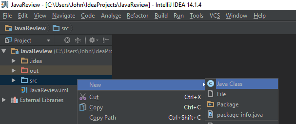

# Brief introduction to classes and methods

## Creating a main class

Go ahead and right-click on the `src` folder and select `Create new class`.

  

Give it a name, we'll be calling ours `Main`, and click `OK`.  For this class only, you'll need to add the method `main` (note it is lowercase `main` since Java is case sensitive).  It should look like this:

```java
public class Main {
    public static void main(String[] args) {

    }
}
```