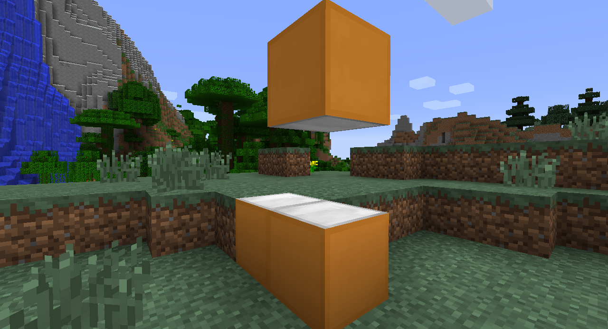

# Making basic blocks

Lastly, we have to add a another method to tell Minecraft which texture to show for each side of the block.

```java
//This function tells which icons to use for which sides of the block
@Override
public IIcon getIcon(int side, int meta) //side = the side of the block
{
    if (side == 0) //Bottom
        return botIcon;

    else if (side == 1) //Top
        return topIcon;

    else //all other sides, numbers 2,3,4,5
        return sideIcon;
}
```

If you did everything correctly, here is how it should look.

