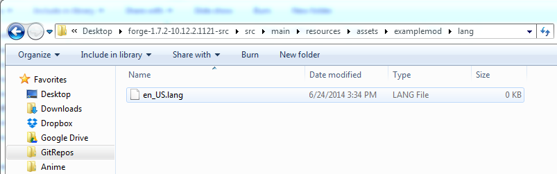
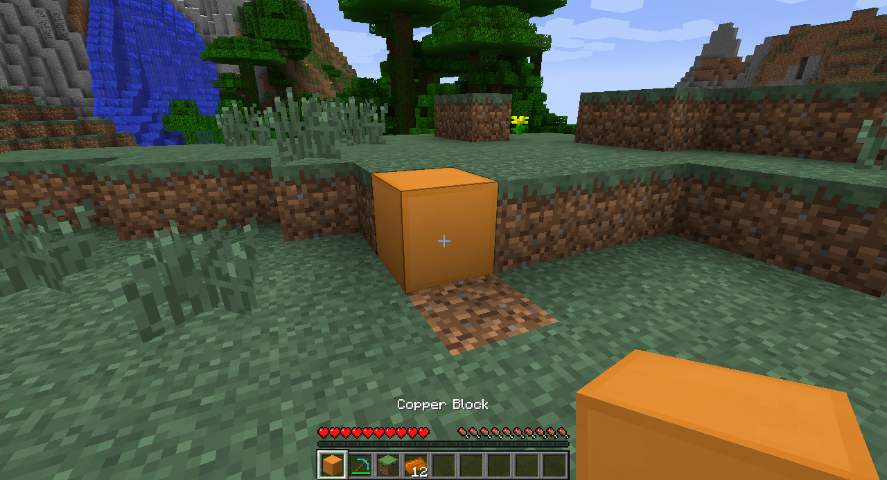

# Making basic items

### Making the language pack

1. Create a folder called "lang" in the "assets/examplemod" folder.
1. Create a new text file called "en_US.lang" in the folder.

1. Right-click on the file and choose to edit it. The default entry is something similar to: `category.blockName.name=Item Name`. The name that appeared for our initial block, `tile.copper_block.name` is what we would use in our case. So my line would be `tile.copper_block.name=Copper Block`.

1. Save the file and run Minecraft. Your name should now appear in-game.

