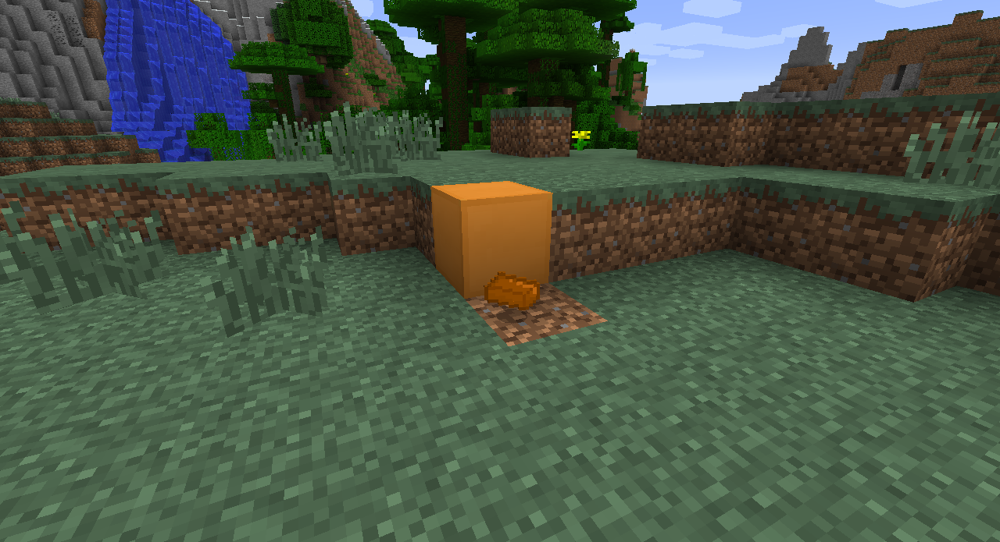

# Adding custom drops and recipes

Right now, our `CopperBlock` only drops itself when broken, like wood does. But what about blocks suchas glowstone? Glowstone drops an item (specifically glowstone dust) when broken. We can modify our existing block easily to drop an item (or multiple items) when broken. Add the following function declaration to the `CopperBlock` class. Launch the game, and try breaking your block. Our copper block will now drop an ingot when mined.

```java
@Override
public Item getItemDropped(int metadata, Random random, int fortune)
{
    return CopperMod.copperIngot;   //this is why we use static variables
}
```

