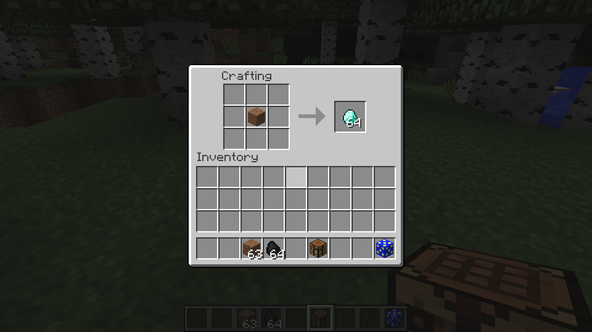
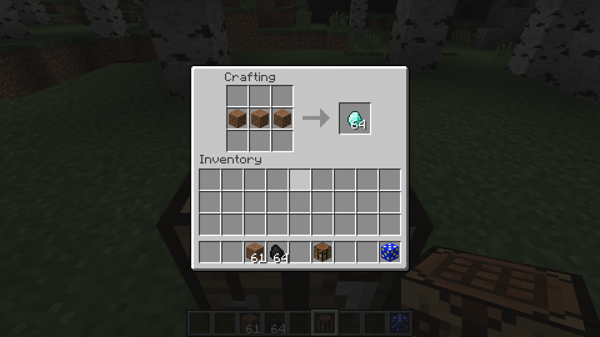

# Adding custom drops and recipes

### Shapeless recipes

First, let's make a shapeless recipe.

```java
GameRegistry.addShapelessRecipe(new ItemStack(Items.diamond, 64), new ItemStack(Blocks.dirt));
```

This recipe simply trades in a stack of 64 dirt blocks for 64 diamonds. The resulting item is the first argument in the function call, and any input items are the following arguments.



To add more items, simply add more ItemStacks within the parentheses.

```java
GameRegistry.addShapelessRecipe(new ItemStack(Items.diamond, 64), new ItemStack(Blocks.dirt),
    new ItemStack(Blocks.dirt), new ItemStack(Blocks.dirt));
```

