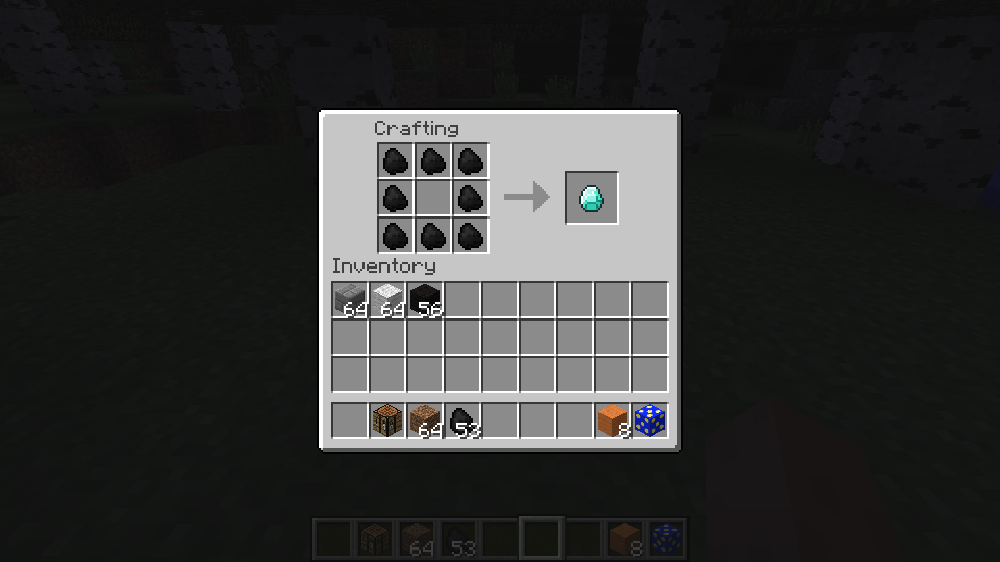

# Adding custom drops and recipes

### Shaped recipes

Next, let's make a shaped recipe. Shaped recipes group the rows of items using letters to represent the type of block. For example, the recipe for TNT would be: `("xyx", "yxy", "xyx", 'x', new ItemStack(Materials.sulphur), 'y', new ItemStack(Blocks.sand))` Pay attention to the double-quotes for the letters representing the recipe shape and the single-quotes for the letters representing the items in the recipe.

> Note: when we leave out the size of the ItemStack, the game will assume a size of 1.

An example of a shaped recipe. You use three strings to represent the three rows of the crafting table and define which letters relate to which type of item. Spaces are used to represent empty crafting slots.

```java
GameRegistry.addShapedRecipe(new ItemStack(Items.diamond), "xxx", "x x", "xxx", 'x',
    new ItemStack(Items.coal));
```

