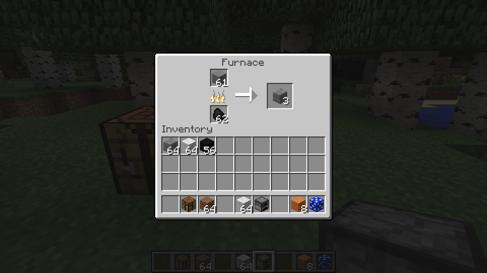

# Adding custom drops and recipes

## Smelting recipes

Smelting recipes are very similar and only require a slightly different function call.

```java
GameRegistry.addSmelting(Blocks.stone, new ItemStack(Blocks.stonebrick), 0.1f);
```

This time, the input item is on the left while the output is on the right. The number at the end specifies how much experience the player receives from the smelting.

