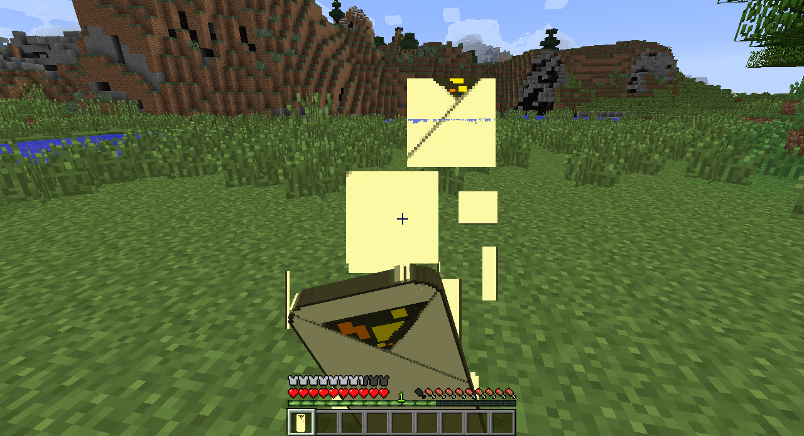

# Creating foods
>In this section, you will learn how to create new foods and add potion effects to them

Any Minecraft player who wants to survive will need to learn about food and food resources. The foods in vanilla Minecraft tend to be straight-forward. You might cook raw beef into steak, or make cookies from cocoa and wheat. Creating your own food classes will let you create more complicated foods and even add potion effects when you eat something!

The `ItemFood` class is the parent class for all of the food items in Minecraft. Anything descended from `ItemFood` can be eaten and has some hunger or saturation values (the saturation value determines how long you can move until hunger starts ticking down again). For example, I wrote an `ItemSteakTaco` class to add tacos. I extended the `ItemFood` class and created a constructor that calls the superclass constructor.

```java
package com.example.coppermod;

import net.minecraft.item.ItemFood;

public class ItemSteakTaco extends ItemFood {
    public ItemSteakTaco(int foodValue, float satmodifier, boolean isWolfsFavoriteMeat) {
        super(foodValue, satmodifier, isWolfsFavoriteMeat);
    }
}
```

The `foodValue` variable determines how much health is restored when the food is eaten, and the `satmodifier` variable determines how long until the player becomes hungry again. To give an idea of these values, `foodValue` is set to 8 and `satmodifier` is set to 0.8 for cooked porkchops. The boolean `isWolfsFavoriteMeat` simply tells whether or not the food is appealing to wolves (only true for some meats by default). After writing the class and creating my texture, I register the new item with the game (simultaneously giving the heal and saturation values).

