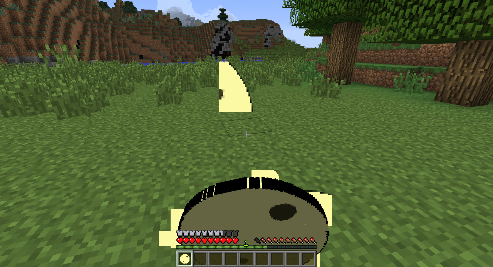

# Creating foods

Tacos don't just appear in the wild, however. We also need to create the ingredients as well as recipes in order to make them. For this example, I will make an `ItemTortilla` class and then create the recipes necessary to make the tortilla and then the taco. `ItemTortilla` is also a food, but will not have as good healing and saturation properties.

```java
package com.example.coppermod.item;

import net.minecraft.creativetab.CreativeTabs;
import net.minecraft.item.ItemFood;

public class ItemTortilla extends ItemFood {
    public ItemTortilla(int foodValue, float satmodifier, boolean isWolfsFavoriteMeat) {
        super(foodValue, satmodifier, isWolfsFavoriteMeat);

        this.setCreativeTab(CreativeTabs.tabFood);
        this.setUnlocalizedName("itemTortilla");
        this.setTextureName(("coppermod:tortilla"));
    }
}
```

