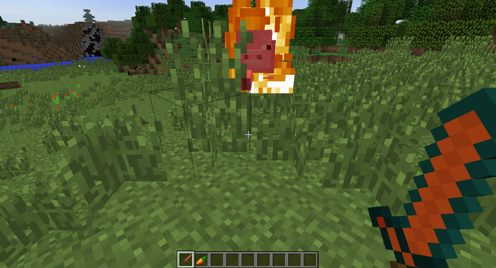
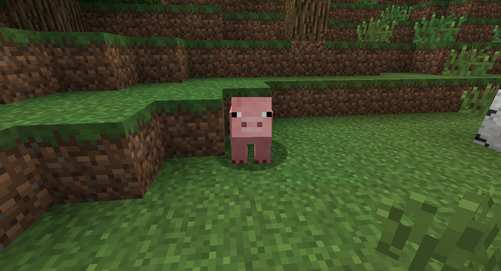
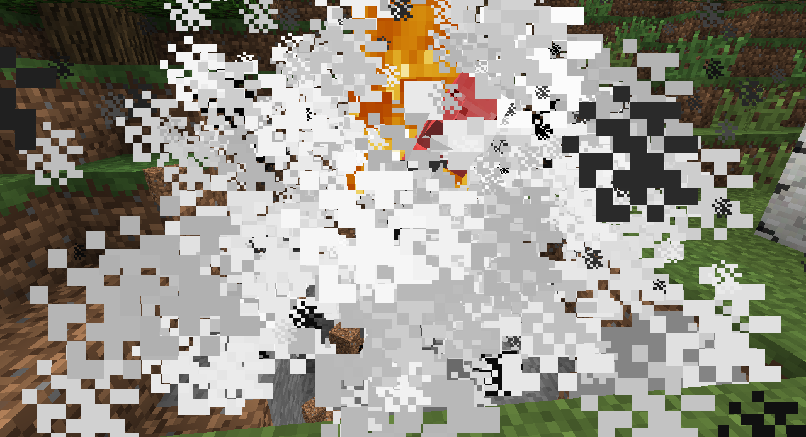

# Making new tools

### Custom tool effects
By knowing how to override the `hitEntity` function, we can create fire, lightning bolts, and even explosions when our tools are used!

Create the following function definition in one of your item classes.

```java
public boolean hitEntity(ItemStack itemHitting, EntityLivingBase entityBeingHit, EntityLivingBase entityHitting)
{

}
```

This function is called whenever the item is used to hit an entity, whether it's a zombie or a spider or even a cow. The `entityBeingHit` variable points to the `Entity` object being hit in the game, and it is the variable that we can use to give effects to our item. For example, we can set the entity on fire when hit.

```java
entityBeingHit.setFire(4);  //what do you think the integer does?
```



We can even create an explosion at the hit entity's location!

```java
entityBeingHit.worldObj.createExplosion(null, entityBeingHit.posX, entityBeingHit.posY, entityBeingHit.posZ,
3.0f, true);  //the float determines the radius of the explosion
```




